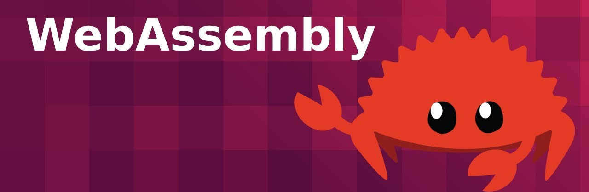

# yew의 getting started 연습 프로젝트

## yew란
wasm기반 프론트엔드 프레임워크

## 다른 프레임워크와의 차별점
#### rust기반이며 js가 아닌 wasm으로 작동한다
rust코드가 wasm-bindgen에 의해 *.wasm 파일로 컴파일된다  
이 파일을 js의 웹API인 WebAssembly.instantiateStreaming() 메소드로 호출하면 *.wasm 코드를 js에서 호출할 수 있게된다.  
js를 거치지 않고 즉시 wasm 코드를 호출할 수 있는 방법은 아직 없다  

## yew 코드의 특징
컴포넌트 기반 리액트와 유사하다.  
다만 타입체킹 등의 이유로 사용법은 조금더 까다롭다

## [공식 홈페이지의 getting started](https://yew.rs/getting-started/build-a-sample-app)

## 다음 TODO 
[yew crash course](https://www.youtube.com/watch?v=lmLiMozWNGA)보고 구조 외우기  
기본중의 기본이다
